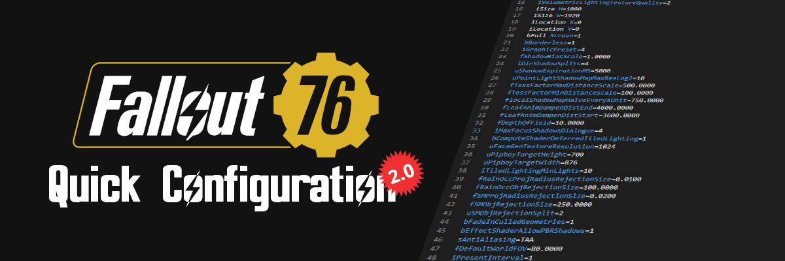
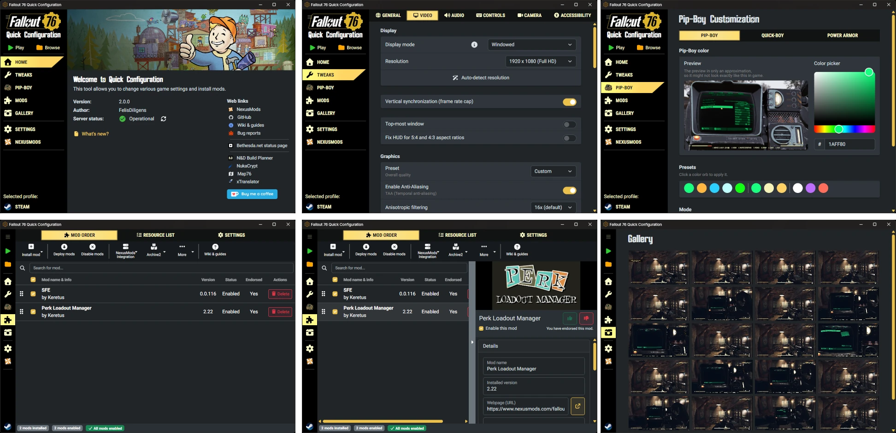

<!--
<p align="center">
  
  
  
  
  <br/>
  
  
</p>
-->

<h3 align="center">
  Change various game settings and install mods.
</h3>

<p align="center">
  <a href="https://github.com/FelisDiligens/QuickConfiguration2/releases/latest">
    
  </a>
  <a href="https://www.nexusmods.com/fallout76/mods/546?tab=files#mod-page-tab-files">
    
  </a>
</p>

<p align="center">
  <a href="https://www.nexusmods.com/fallout76/mods/546?tab=images#list-modimages-1">Screenshots</a> |
  <a href="https://github.com/FelisDiligens/QuickConfiguration2/wiki">Wiki & Guides</a> |
  <a href="https://www.nexusmods.com/fallout76/mods/546?tab=posts#comment-container">Posts</a> |
  <a href="https://www.nexusmods.com/fallout76/mods/546?tab=bugs#tab-modbugs">Bugs</a>
</p>

## Screenshots



## ★ New

Version 2.0 is a complete rewrite of the old [Quick Configuration](https://github.com/FelisDiligens/Fallout76-QuickConfiguration).

Improvements of 2.0 over the previous version:

- Redesigned web-based user interface and high DPI support
- Simplified mod manager with support for multiple BA2 archives in a single mod
- Steam Deck and Linux support with native builds

Regressions:

- Custom tweaks page was removed. Please edit the ini files directly.
- Gallery page can only display photos and screenshots. Other features are not available for now.

This version should be a drop-in replacement for version 1.12.9. Most settings are carried over.

See the changelog for more: [CHANGELOG.md](https://github.com/FelisDiligens/QuickConfiguration2/blob/main/CHANGELOG.md)

## Features

### \*.ini tweaks

- Change display, graphics, volume, audio, interface, and voice chat settings.
- Disable VSync (frame rate cap).
- Change your FOV with a preview of how it looks in-game.

### Pip-Boy customization

- Change the color and resolution of your Pip-Boy and Quick-Boy.
- Use color presets from previous Fallout games.
- See a preview of how the color will look in the game.

### Mod manager

- Install and manage mods.
- Manage the resource list.
- Integrates with NexusMods (requires logging in to NexusMods):
  - Show additional information and a preview image for each mod.
  - Check if a mod has an update.
  - Use the "Download with Mod Manager" button on NexusMods.

### Gallery

- Access all your screenshots and photos from the gallery.

## Requirements

### Windows

On Windows, the app uses Microsoft Edge WebView2.  
It's preinstalled on Windows 10 (Version 1803 and later with all updates applied) and Windows 11. If you use an earlier version of Windows (or you have uninstalled it), download and install WebView2:  
[Download WebView2 Evergreen Bootstrapper](https://developer.microsoft.com/en-us/microsoft-edge/webview2/#download-section)

The setup will do this automatically for you.

### Linux and Steam Deck

On Linux, the app uses [webkit2gtk](https://webkitgtk.org/).  
It should come bundled with the AppImage, but in case you need it anyways:

| Distribution    | Package names                         |
| --------------- | ------------------------------------- |
| Arch / Manjaro  | `webkit2gtk` `gtk3`                   |
| Debian / Ubuntu | `libwebkit2gtk-4.1-0` `libgtk-3-0t64` |
| Fedora          | `webkit2gtk4.1` `gtk3`                |

Additionally, you have to install `wine` if you want to create or extract \*.ba2 archives.

## Installation

### Windows

#### Installer (recommended)

1. [Download](https://github.com/FelisDiligens/QuickConfiguration2/releases/latest) the file that ends on `*-setup.exe`.
2. Run the setup.
3. It should install and you can run it from the start menu.

#### Portable zip archive

1. Make sure to install all requirements: Edge WebView2 and Visual C++ Redistributable
2. [Download](https://github.com/FelisDiligens/QuickConfiguration2/releases/latest) the `*.zip` archive and unzip it.
3. Run `f76qc2.exe`

### Linux and Steam Deck

#### AppImage

1. [Download](https://github.com/FelisDiligens/QuickConfiguration2/releases/latest) the `*.AppImage` file.
2. Ubuntu users will have to install FUSE v2:
   ```bash
   sudo apt install libfuse2
   ```
   If you have issues due to FUSE, see: [AppImageKit wiki](https://github.com/AppImage/AppImageKit/wiki/FUSE)
3. You may need to add execution permission to the file:
   ```bash
   chmod +x ~/Downloads/*.AppImage
   ```
   Depending on your desktop environment, you can also just right-click the file, click on "Properties", and then check "Executable as Program". [Screenshot for GNOME / Nautilus](./assets/nautilus-add-executable-permission.png)
4. Double-click the `*.AppImage` file to run it.

You can place the AppImage file anywhere you want and even rename it. If you want to integrate it into the app menu, I recommend [Gear Lever](https://flathub.org/en/apps/it.mijorus.gearlever). Have fun.

## Wikis & Guides

- [Frequently Asked Questions](<https://github.com/FelisDiligens/QuickConfiguration2/wiki/Frequently-Asked-Questions-(FAQ)>)
- [Troubleshooting](https://github.com/FelisDiligens/QuickConfiguration2/wiki/Troubleshooting)
- [Mod Manager Guide](https://github.com/FelisDiligens/QuickConfiguration2/wiki/Mod-Manager-Guide)

## For developers

See [BUILD.md](BUILD.md).

## License

> [MIT License](LICENSE)

See [choosealicense.com](https://choosealicense.com/licenses/mit/) for an overview.

## Built with

<table>
  <tbody>
    <tr>
      <td align="center"></td>
      <td align="center"></td>
      <td align="center"></td>
      <td align="center"></td>
    <tr>
    <tr>
      <td align="center"><a href="https://www.rust-lang.org/">Rust</a></td>
      <td align="center"><a href="https://tauri.app/">Tauri</a></td>
      <td align="center"><a href="https://www.typescriptlang.org/">Typescript</a></td>
      <td align="center"><a href="https://react.dev/">React</a></td>
    </tr>
  </tbody>
</table>

(and a ton of other fantastic libraries)
